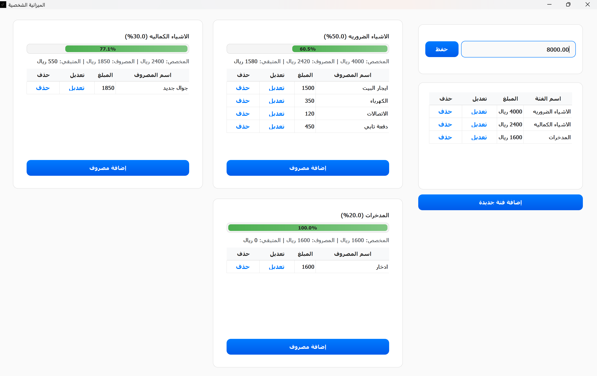

# Personal Budget Application

## 🧾 Project Overview
**Personal Budget** is a modern desktop application built with **PyQt5** that helps users manage their monthly income, spending categories, and expenses efficiently.  
It features a clean Apple-inspired interface styled with **QSS**, and all user data is safely stored in a lightweight **JSON** file.

The app allows you to:
- Define your **monthly income**.
- Create, edit, and delete **budget categories** with percentage allocations.
- Add, modify, or remove **expenses** per category.
- Instantly see remaining budget amounts with dynamic progress bars and styled visuals.

---

## ✨ Features
- 🏠 **Main Window (MainWindow):** Hosts the entire user interface through stacked views.
- 💼 **Budget Manager (BudgetManager):** Handles all JSON-based data storage and logic.
- 💸 **Budget Window (BudgetWindow):** Main interactive screen for categories, income, and expenses.
- 🧩 **Dialogs:** User-friendly popups for adding or editing categories and expenses.
- 🎨 **Custom Styles:** QSS themes for an Apple-like modern look (`budget.qss`, `dialogs.qss`).
- 🧠 **Smart Updates:** Uses PyQt signals and timers for safe UI refreshes.
- 💾 **Persistent Storage:** Automatically saves and loads data from `core/data/data.json`.

---

## 📁 Project Structure

```
project/
├── app.py                     # Application entry point
├── core/
│   ├── budget_manager.py      # Handles income, categories, and expenses (JSON)
│   └── data/
│       └── data.json          # Saved user data
├── ui/
│   ├── main_window.py         # Main window logic
│   ├── budget_window.py       # Budget interface
│   ├── dialogs.py             # Category & Expense dialogs
│   ├── qss/
│   │   ├── app.qss
│   │   ├── budget.qss
│   │   └── dialogs.qss
│   └── icons/
│       └── app_icon.ico
└── config/
    └── settings.py            # Global configuration and resource paths
```

---

## 🧠 How It Works

1. When the app launches, `app.py` sets up the environment and applies the QSS style.  
2. `MainWindow` creates the core interface and loads `BudgetWindow`.
3. `BudgetWindow` interacts with `BudgetManager` to read and update data from `data.json`.
4. All dialogs (`CategoryDialog`, `ExpenseDialog`) communicate with the manager to update the budget dynamically.
5. Toast notifications appear for all successful or failed operations.

---

## 🖼️ Application Preview

Below is a placeholder for the application preview:



> Replace this image with your actual screenshot at  
> `ui/screenshots/app_preview.png`

---

## ⚙️ How to Run (Development)

1. Install dependencies:
   ```bash
   pip install PyQt5
   ```
2. Run the application:
   ```bash
   python app.py
   ```

---

## 🧰 Build Executable (.exe)

Before building, make sure **PyInstaller** is installed:

```bash
pip install pyinstaller
```

Then, run this command inside your project directory:

```bash
pyinstaller --name "Personal Budget" --onefile --noconsole --icon=ui/icons/app_icon.ico --add-data "ui/qss;ui/qss" --add-data "core/data;core/data" app.py
```

After building, you’ll find the executable inside the `dist/` folder:

```
dist/
 └── Personal Budget.exe
```

---

## 📦 Deployment Notes

Make sure the following folders are placed **next to** your `.exe` file:

```
ui/qss/      ← Style files (.qss)
ui/icons/    ← Application icon (.ico)
core/data/   ← Data file (data.json)
```

If the data folder does not exist, it will be created automatically when the app runs.

---

## ✅ Done!

You can now launch **Personal Budget.exe** and enjoy your modern budget manager 🎉
